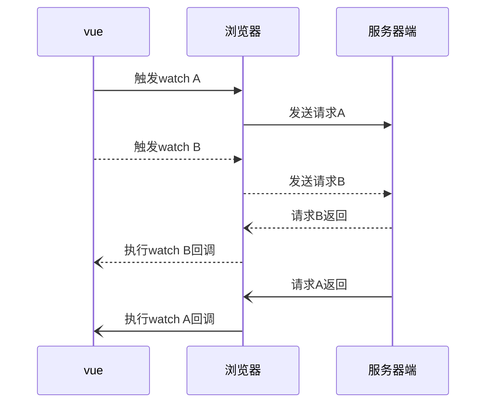

个人跟随[《Vue.js设计与实现》](https://www.douban.com/search?q=vue.js%E8%AE%BE%E8%AE%A1%E4%B8%8E%E5%AE%9E%E7%8E%B0)一书实现的"穷人版"Vue.

> - 相关博客文章: [跟着霍春阳写个"穷人版"的vue
](https://juejin.cn/post/7224841852305555512)

# 概述

基本实现了Vue的常用api, 包含:

1. vue-reactive相关: 
- reactive/shallowReactive
- ref/toRef/toRefs/shallowRef/proxyRefs
- readonly/shallowReadonly
- computed(get + set)/watch

2. vue-render相关
- effect/nextTick/renderer
- onMounted/onUnmounted 等绝大部分生命周期钩子
- setup/render等组件化实现
- 异步组件AsyncComponent

3. 内置组件KeepAlive/Teleport/Transition

4. 只有运行时,不含编译时部分.

# Demo

目前已实现了基于该`mini-vue`的TodoMVC基本可运行版, 详见`/examples/todomvc`
  - 可能有些边界条件还未处理好.
  - 因为没有编译时,所以dom部分需使用渲染函数编写, 不支持`<template>`


# 盲点记录

## Watch回调的第三个参数
vue的watch有三个参数: 监听源, 回调, 配置选项. 其类型定义如下: 


提问: 其中第二个参数callback函数, 有哪些参数呢? 可能有很多同学跟我一样, 只用过`(val, oldVal) => {...}`的形式, 但其实这个callball函数还有比较偏门的第三个参数: 


由上述的类型定义可知, 第三个参数`onCleanup`是一个函数. 官方文档简单提了一下, 说这个`onCleanup`是用于清除副作用的, 但具体使用方法, 文档上的解释和示例有点含糊了, 以至于貌似很少有人使用.


其实这个onCleanup的功能非常简单: **可以调用onCleanup传入一个函数, 这个函数将在下一次回调执行时调用(本次回调不会调用)**. 使用示例:
```javascript
let obj = { foo: 0 };
watch(obj, async (val, oldVal, onCleanup) => {
    // 给onCleanup传入一个函数,这个函数将在下一次回调执行时调用, 也就是说,
    // 当obj.foo=1时传入了这个函数, 下一次obj.foo=2时回调执行, 这个传入的函数也将执行
    onCleanup(() => { 
        console.log(obj.foo) // 2
    });
})

obj.foo ++ ;
setTimeout(() => { obj.foo ++ }, 200); 
```
vue的watch中的伪代码实现如下: 
```javascript
function watch(source, cb, options = {}){
    // ...
    let cleanup; // cleanup函数是闭包保存在watch内的
    function onCleanup(fn){
        cleanup = fn
    }
    // 如果上一次回调保存了cleanup, 则执行一下
    if(cleanup) {
        clearnup();
    }
    cb(val, oldVal, onCleanup); // clearnup函数传给callback以便外部调用
    // ....
}
```
从上述实现可见, 这个`onCleanup`函数功能非常单一, 只是为了给watch内闭包保存一个cleanup内部函数而已. 

这个cleanup的设计初衷, 其实是用于解决watch中的**异步回调的竞态问题**. 

如果watch回调是异步回调函数, 可能出现后一次执行比前一次执行先触发回调, 那么前一次回调执行的副作用就会覆盖后一次执行的副作用, 导致出错. 例如下述代码: 

```javascript
let finalData;
let obj = { foo: 0 };
watch(obj, async () => {
    // foo作为入参, res将与foo的值相关
    const res = await fetch(`path/to/request?id=${obj.foo}`);
    finalData = res;
});
obj.foo++;
nextTick(() => { obj.foo++ })
```

上述代码因为foo发生两次递增, 将会触发两次watch的异步回调. 我们期望的finalData的值应该是最后一次请求的返回值, 但假如第一次回调发出的请求因为网络堵塞而晚于第二次回调返回(见下图), 那将导致finalData最后保存的数据变成第一次请求(`id=1`)时的值.


这种情况下, 第三参`onCleanup`就派上用场了: 使用`onCleanup`传入一个函数, 设置当前callback为无效, 下一次当有watch-callback执行时将调用该函数. 这样一来, 就只有最后一次调用的callback会赋值给finalData, 与异步函数的返回时机无关了.

```javascript
watch(obj, async (val, oldVal, onCleanup) => {
    let expired = false;
    // 使用`onCleanup`传入一个函数, 设置当前callback为无效, 
    // 当有后续callback时, 会将调用该函数, 将当前回调的expired置为true
    onCleanup(() => { 
        expaired = true 
    });
    const res = await fetch(`path/to/request?id=${obj.foo}`);
    // 只有最后一次调用的异步请求的expired=false, 才会写入finalData
    if(expired){
        finalData = res;
    }
})
```


## Vue的构建版本
我们平时使用Vue, 多数情况下都是在web端用vue-cli自动生成的, `vue + webpack + babel`等一整体全家桶技术栈开箱即用. 这种情况下,我们使用的其实只是基于webpack的vue-module构建版本而已, 事实上, 可能很多人不知道, vue还有其他构建版本: 

#### 1. vue.global.js
- 用于传统浏览器的IIFE模式包
- **这是一种比较有实用意义的Vue版本, 比如当我们要实现一些简单的功能, 不想用webpack等打包工具, 只想直接使用vue来作为一个数据驱动工具的时候, 或者只想用vue快速写个demo测试一下页面功能, 这时可以直接使用这个版本, 不需构建流程, 非常轻量级**. 
- 引入方式: `<script src="vue.global.js" />`
- 实现方法: (IIFE)
```javascript
const vue = (function(exports){
    exports.createApp = createApp;
    exports.xxx = xxx;
    return exports;
})({})
```
- 应用方式: 
```
<!DOCTYPE html>
<html lang="en">
<body>
  <div id="app"></div>
  <!-- vue.global.js是vue打包的能直接在现代浏览器中允许的版本 -->
  <script src="https://unpkg.com/vue@3/dist/vue.global.js"></script>
  <script type="module">
    // Vue的浏览器版本会将常用API暴露在全局变量Vue中
    const { createApp, ref,h, nextTick  } = Vue
    const VueComp = {
      setup() {
        const name = ref('111');
        const handleClick = () => {
          name.value = '222';
          nextTick(() => {
            const text = document.querySelector("#app").textContent;
            alert('当前Html内容: '+text);
          });
          name.value = '333';
        }
        return {
          name,
        }
      },
      render(){
        return h('div', {onClick: () => handleClick() }, [name.value])
      }
    };
    const app = createApp(VueComp).mount('#app');
  </script>
</body>
</html>
```
> 上述代码引自我的另一篇[文章](https://juejin.cn/post/7179077094754746426)

#### 2. vue.ems-browser.js
- 用于现代浏览器的ems模块包
- 引入方式: `<script type="module" src="vue.ems-browser.js" >`
 
#### 3. vue.ems-bundle.js
- 使用rollup/webpack等打包工具使用的ems版本
- 实现: rollup/webpack等找资源时，如有`module`,会优先取`module`,否则才取`main`,所以使用这类打包工作时output的文件是`vue.ems-bundle.js`
```
// vue/package.json
{
    ...
    "module": "dist/vue.runtime.esm-bundler.js",
}
```
- 区别ems-browser: vue源码中的`__DEV__`变量会替换为`process.env.NODE_ENV !== 'production'`.
    - 因为`__DEV__`为rollup变量，使用通用的`process.env.NODE_ENV`, 用户可在webpack中自行决定构建环境

#### 4. vue.cjs.js
- commonjs版本的vue
- 用于SSR, 在node.js环境中使用


## `HTML Attributes(Attrs)` 与 `DOM Properties(Props)`
#### 定义
- Attrs: 定义在html标签上的属性
- Props: 浏览器解析html生成的DOM对象上的属性

#### 处理缘由
- vnode在进行patch算法时需要处理Props的挂载和更新, 所以需要处理Attrs和Props而差异

普通HTML文件被浏览器解析后, 会自动分析Attributes并设置合适的props, 我们不需要干预. 但Vue的单文件组件并不会被浏览器解析, 所以原本由浏览器完成的工作, 现在需要由vue来完成.

#### 关系和差异
- Attrs主要用于html上, 不区分大小写; Props主要用于js上, 区分大小写

- 很多Attrs在DOM对象上有同名的Props
  - 有些不同名, 如class(attrs上)与className(props上)
  - 有些Attrs没有对应的Props, 如`aria-xxx`
  - 有些Props没有对应的Attrs, 如`el.textContent`
 
- 关系: Attrs的作用是设置与之对应的Props的**初始值**
  - 值改变后Props存储当前值,而Attrs始终保持初始值, 如`<input>`的`value`属性
  - HTML初始化时,浏览器会解析Attrs并设置合适的Props
    - Attrs提供值不合法时, Props会取默认值 
   
- 读写方式:
  - Attrs: `el.setAttribute(key, val)` | `el.getAttribute(key)`
  - Props: `el[key]` | `el[key] = val`

- `setAttribute`设置的`val`值总会被字符串化
  - `btn.setAttribute('disabled', false)`等价于 `btn.setAttribute('disabled', 'false')`
- 特殊对应关系:
  - 布尔类型的`props`, 如按钮的`disabled`,只要有该属性都会识别为`true`, 而不会管具体的属性值
    - eg: `<button disabled />`
  - 特殊情况, 如`<input form="form1">`

#### Vue的处理方式

对于Attrs的赋值, vue的实现代码如下: 
```javascript

function shouldSetAsProps(el, key, value) {
    if (key === 'form' && el.tagName === 'INPUT') return false;
    return key in el; // 判断property的方法
}

function mountElement(vnode, container, anchor) {
    // 判断是否应该按props的方式赋值
    if (shouldSetAsProps(el, key, nextValue)) {
      const type = typeof el[key];
      // 矫正无属性值的情况
      if (type === 'boolean' && nextValue === '') {
        el[key] = true;
      } else {
        el[key] = nextValue;
      }
    } else {
      // 否则按attrs方式赋值
      el.setAttribute(key, nextValue);
    }
}
```
由上可知Vue的赋值方式为: 
1. 优先考虑设置为Props; 
2. 当值为空字符串时手动矫正为true; 
3. 使用`setAttribute`兜底处理特殊情况


## keepAlive的缓存对象

对于keepAlive, 我原先直觉性地认为, vue是将vnode(虚拟DOM)缓存起来, 等到activated的时候再取vnode数据, 渲染成DOM. 但跟着这本书实现了一遍, 才发现keepAlive其实直接缓存的就是是DOM和instance, 而并不是vnode!

虽然有存vnode, 但是为了通过vnode.component拿到实际的DOM对象而已. 

本质上,DOM其实也是了一串对象, 直接存入取出就好, 确实没必要特地转来转去.

## 其他杂项

- vue3提供了纯响应式API包: `@vue/reactivity`. 只含数据相关的响应式API, 不含vnode/渲染器/diff算法等
 
- 单调递增子序列: vue的快速diff算法使用了求**单调递增子序列**的算法. 类似的力扣题为 [300. 最长递增子序列](https://leetcode.cn/problems/longest-increasing-subsequence/). 

- 通常children是个string|array|null, 但组件的children会被编译成一个对象,以便进行命名插槽的匹配

- props选项是shallowReactive, 并非深层的

- vue3中设置不支持选项式API: 定义`__VUE_OPTION_API__ = false`. 
  - eg：`new webpack.DefinePlugin({__VUE_OPTION_API__: JSON.stringify(false)})`
- 只有setup中才有instance的概念, 才能使用getCurrentInstance

- Set的无限循环问题：在Set的forEach循环中, 如果删除一个值，再重新加回，则该值会重新被访问。从而会导致无限循环.
  - 解法：构造一个新的Set来循环，在循环中就可以删除原来的Set中的值
  ```
  const set = new Set([1]);
  const newSet = new Set(set);
  newSet.forEach(item => {set.delete(1);set.add(1)})
  ```

- `Teleport`的实现是patch层级的, vue2如果要实现需要动到核心代码逻辑, 所以尽管vue2.7提供了composition-api, 但仍未提供官方支持的Teleport, 只能使用其他polyfill方案


